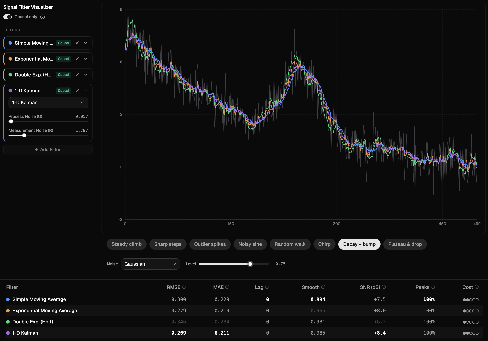

# Signal Filter Visualizer

An interactive single-page app for exploring how different smoothing and filtering algorithms transform noisy data. Pick a signal, dial up noise, compare up to 4 filters side by side, and watch the results update live.

Built as a teaching tool — every dataset is chosen to make at least one filter shine and at least one filter struggle.



## Features

- **8 base signals** designed to expose filter tradeoffs (sharp steps, outlier spikes, chirp, random walk, etc.)
- **7 filters**: SMA, EMA, Double Exponential (Holt), Gaussian Window, Savitzky-Golay, Median, 1-D Kalman
- **4 noise types**: Gaussian, heavy-tailed (Cauchy), bursty, heteroscedastic
- **Causal mode toggle** — force all filters into real-time (trailing-only) behavior and watch lag appear
- **Comparison table** with 7 metrics (RMSE, MAE, phase lag, smoothness, SNR improvement, peak preservation, computational cost) — all computed against the clean ground-truth signal
- **Click-drag zoom** on the chart
- Dark theme

## Quick Start

```bash
npm install
npm run dev
```

Open [http://localhost:5173](http://localhost:5173).

## Stack

- [React](https://react.dev) + [Vite](https://vite.dev)
- [Recharts](https://recharts.org) for plotting
- [shadcn/ui](https://ui.shadcn.com) (New York variant) + [Tailwind CSS](https://tailwindcss.com)

## Project Structure

```
src/
  App.jsx                   # Layout shell, state management
  components/
    Chart.jsx               # Recharts wrapper with zoom
    DatasetBar.jsx           # Signal selector chips + noise controls
    FilterCard.jsx           # Collapsible filter with type picker + param sliders
    FilterStack.jsx          # Manages list of FilterCards + "Add Filter" button
    CausalToggle.jsx         # Causal mode switch + info popover
    ComparisonTable.jsx      # Full-width metrics table
  signals/
    index.js                 # Signal registry + generateSignal()
    curves.js                # Base curve functions
    noise.js                 # Seeded noise generators (4 types)
  filters/
    index.js                 # Filter registry + applyFilter()
    sma.js                   # Simple Moving Average
    ema.js                   # Exponential Moving Average
    holt.js                  # Double Exponential (Holt)
    gaussian.js              # Gaussian Window
    savitzkyGolay.js         # Savitzky-Golay
    median.js                # Median Filter
    kalman.js                # 1-D Kalman
  utils/
    stats.js                 # RMSE, MAE, phase lag, smoothness, SNR, peak preservation
```

## Adding a New Filter

Each filter is a self-contained module. Adding one requires **one new file and one import line** — zero UI changes.

### 1. Create the filter file

```js
// src/filters/myFilter.js
export const meta = {
  name: 'My Filter',
  key: 'my-filter',
  causal: true, // or false — determines badge and causal-mode behavior
  complexity: {
    rating: 2,          // 1-5 filled circles for the Cost column
    bigO: 'O(n)',
    tooltip: 'Brief description of real-world computational cost.',
  },
  params: [
    { key: 'windowSize', label: 'Window Size', min: 3, max: 101, step: 2, default: 21 },
    // Add more params as needed
  ],
}

// Signature: (number[], params, { causalMode }) => number[]
export function apply(data, { windowSize }, { causalMode } = {}) {
  const result = new Array(data.length)
  // ... your filter logic
  return result
}
```

**Notes:**
- `meta.params` drives the UI automatically — a slider is rendered for each entry
- For inter-param constraints, add a `maxFn` to a param: `maxFn: (params) => params.windowSize - 1`
- Non-causal filters should branch on `causalMode` to provide a trailing-only implementation

### 2. Register it

```js
// src/filters/index.js
import * as myFilter from './myFilter'

export const filterRegistry = [sma, ema, holt, gaussian, savitzkyGolay, median, kalman, myFilter]
```

That's it. The filter appears in the dropdown, gets a color, shows up in the comparison table.

## Adding a New Signal

Add a curve function in `src/signals/curves.js`, then register it in `src/signals/index.js` with a unique seed:

```js
{ key: 'my-signal', label: 'My Signal', points: 500, seed: 12345, curve: mySignalFn },
```

## Adding a New Noise Type

Add a generator function in `src/signals/noise.js`, register it in the `noiseTypes` array and `generators` map, and assign it a unique seed offset in `generateNoise()`.

## License

MIT
